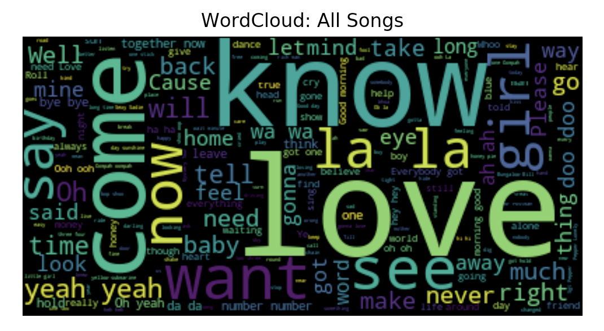
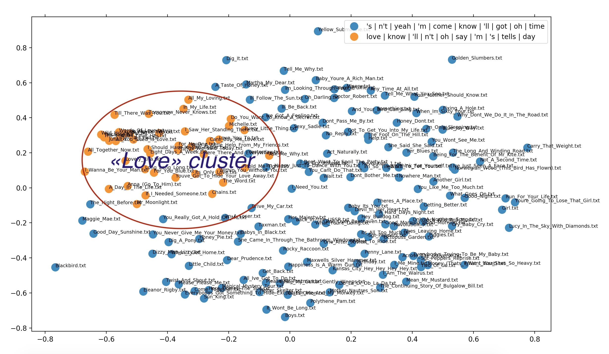

# NLP test task

Tasks: 

- Find 3 most relevant songs for all three terms 'all' 'is' 'love' simultaneously. Describe relevance finding technique.

- Cluster all The Beatles songs into three clusters. Describe clusters, visualize them.

- What other supervised and unsupervised algorithms can be applied to this dataset? 

## How to run

- All the research way was described in [notebooks](notebooks) folder.
There one can find my researches on document search ranking and document clustering. 
Highly recommend to go through notebooks there. All the explanations are also there.
Relevant notebooks are: [basic_EDA](notebooks/basic_EDA.ipynb), [ranking](notebooks/document_search_ranking.ipynb), 
[clustering](notebooks/document_clustering.ipynb), 
[generation](notebooks/generation.ipynb).

- "Production-ready" python files with respect to the tasks are: 
[document_clustering.py](document_clustering.py) and [document_search_ranking.py](document_search_ranking.py).

```
python document_search_ranking.py --query 'all is love'
python document_search_ranking.py --query 'love'
python document_search_ranking.py --query 'Eleanor Rigby'
python document_search_ranking.py --query 'london rain'
python document_search_ranking.py --query 'submarine love tree lemon'
```
```
python document_clustering.py --n_clusters 2
python document_clustering.py
```

## Requirements

To install required packages run:

```bash
pip install -r requirements.txt
```

## Data

To download and structure data [loader](preprocessing/loader.py) was developed.

## What other supervised and unsupervised algorithms can be applied to this dataset? 

- Natural language generation - (not so "natural - we have poems here") - to generate new songs. 
    Pure AI's task - to resurrect old bands or artists
    with generating their music and lyrics. I tried to do some per-character modeling with LSTM, but was unable to
    fit for a long time on local computer, as a result - random symbols :)
    But I'm sure it will be more nice if fitting for longer time - see [notebook](notebooks/generation.ipynb).
    Better even to start with general english texts (wiki articles or Shakespeare poems) - to have more data - 
    for the model to understand in general how words and sentences are constructed. And as a last training phase - 
    continue fitting model (update weights couple more times) on Beatles' lyrics.
    When running notebook in Colab for 20 epochs got (it started understanding something):
    "w see something baby canl shout shout shoot shoot shoot shoot shoot shoot shoot shoot shoot shoot sh"
    "mine mine mine mine gond mine gond morning good morning good morning good morning good morning good"

- Summarizing (song's title generation) - can try to treat song's text as an X, 
    song's title as a y (dependant variable), and try to generate song's titles from song's text.
    There will be not so many instances, but we can try. In most cases song's title is one of the 
    keywords in text.
    
- Topic modeling - discover abstract topics across texts

- Relation extraction - to extract semantic relationships between entities across all the song

- Classification (with using external sources) - build a classifier to predict who wrote a lyrics for a song.
    
- Classification - artist's styles are changing with time, this affects their lyrics. Can try to fit classifier 
    to classify which song 
    belongs to which album. But again - need to be careful - not so much instances per-class.
    
- Similarity tasks - similar to what we did in clustering tasks - we can try to fit unsupervised algorithms 
    to measure phrase or sentences similarities.
    
- NER/POS - but without labeled examples - can use (for example) Spacy to get pos of each word separately.
    Or NER to try to extract entities from texts.
    
## All Beatles songs word cloud



## 2 clusters clustering



## License

This project is licensed under the MIT License - see the [LICENSE](LICENSE) file for details.
